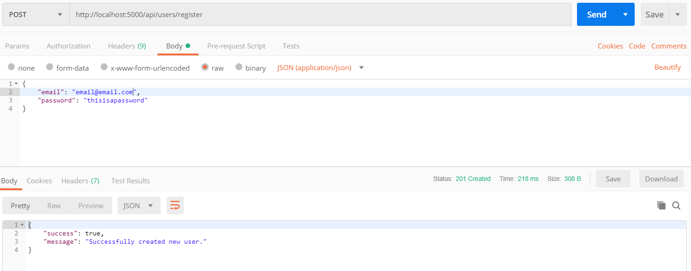
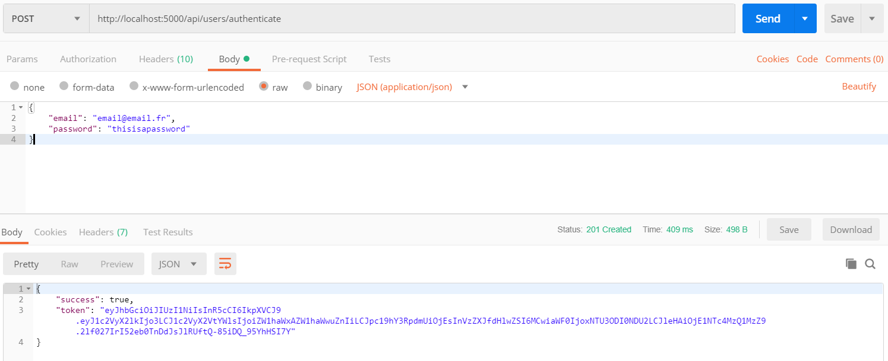
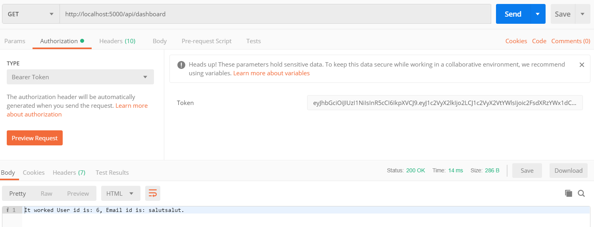

# Passport-jwt-mysql

This project is to understand the principals of user registration, user authentication and protected routes.
For that we will use the modules bcrypt that will allow us to hash and compare passwords.
jsonwebtoken for creating a token when the user is correctly logged.
mysql to interact with a database.
passport to check if a token is present in the request before sending that request.

## Step 1 : Installation

```
$ npm install
```

## Step 2 : Starting the server

```
$ npm run start-dev
```

## Usage

### Creating a user

To create a user :

- POST request on /api/users/register
- On the body : a JSON object with a email and a password properties
- If the user is correctly created a 201 response is emitted with a JSON object containing a success property which is a boolean (true on sucess) and a message

#### Example of request



### Authenticating a user

To authenticate a user :

- POST request on /api/users/authenticate
- On the body : a JSON object with a email and a password properties
- If the user is correctly authenticated a 201 response is emitted with a JSON object containing a success property which is a boolean (true on sucess) and a token

#### Example of request



### Getting the dashboard

To get the dashboard :

- GET request on /api/dashboard
- This route is protected so you have to have a token emited in the header request as a bearer token
- If the token is present in the header the response will be a string with the user id and his email

#### Example of request



## Contributing

Pull requests are welcome. For major changes, please open an issue first to discuss what you would like to change.

Please make sure to update tests as appropriate.

## License

[MIT](https://choosealicense.com/licenses/mit/)
